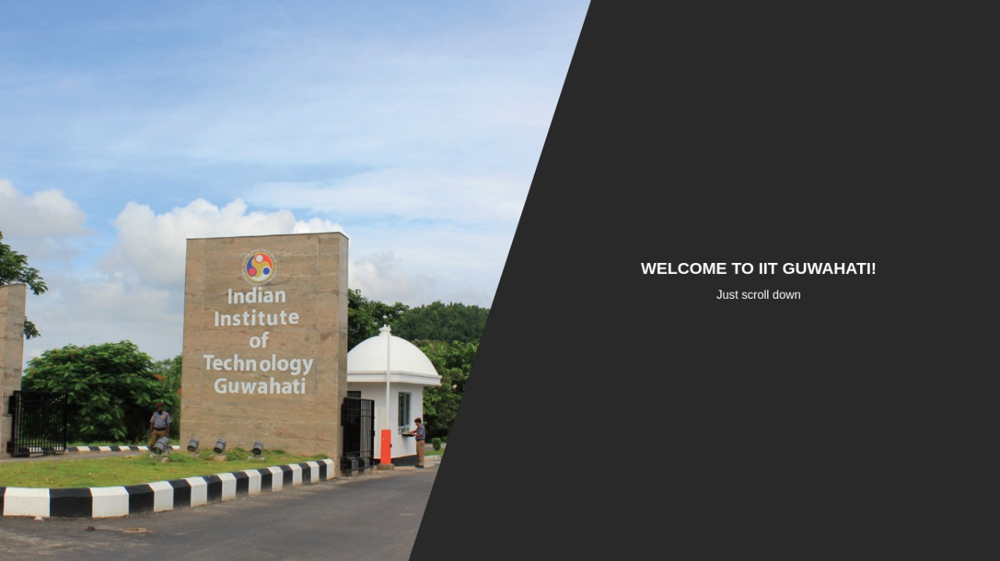
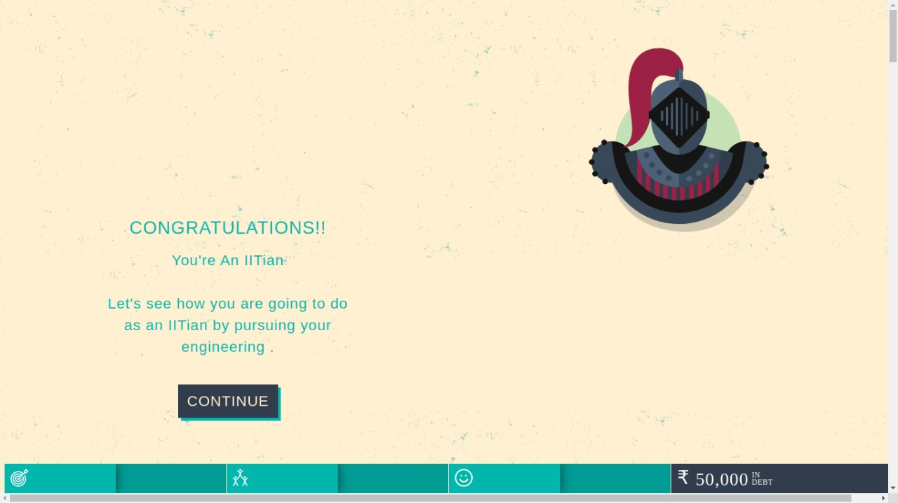
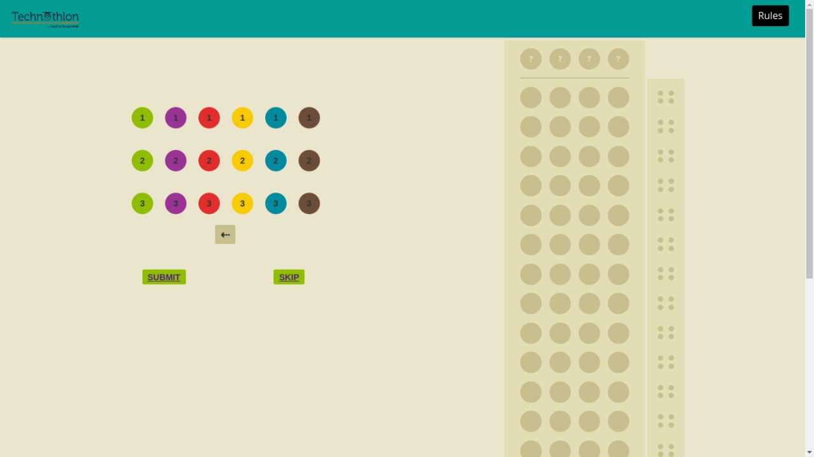
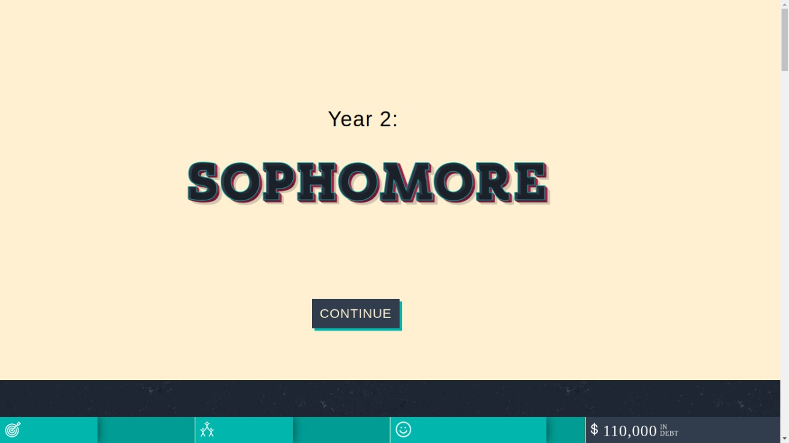
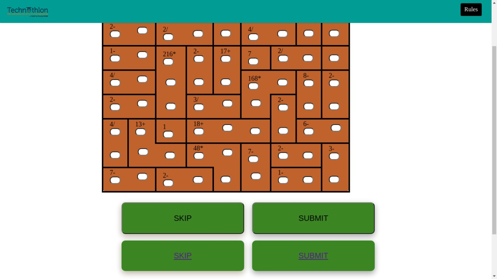

<!-- # Campus La Vie

## What is this?
Campus La Vie is a replica of a students life at IIT Guwahati. In this replica, students was asked about the vital decisions, a student needs to take during his/her stay at IIT Guwahati.
A student needs to pass through four examinations - Kenken, Mastermind, Crypto Puzzle and Mystery Room. In order to step story line up, we used story of an average IITian to form basis of game.  

## Why did we build this?
Campus La Vie was built for the [**Mains Event of Technothlon'20**](https://technothlon.techniche.org.in/mains) as a test for the ability of the young champs from all over India. 

## What did we build this with?

We used JavaScript, along with basic HTML and CSS, for the front-end and Django for the backend.

## ScreenShots from Game.






## Contributors
This game was developed by [Shridam Mahajan](https://github.com/shridam1207),  [Abhay Kandhve](https://github.com/KANDHVE950) ,[Tushar Bajaj](https://github.com/bajajtushar094), [Sushant Reddy Manda](https://github.com/SushanthReddyManda), [Shrusti Jain](https://github.com/debug-shush),
<br> 
 
  -->
<!-- ### CAMPUS LA VIE -->
<h1 align="left">
  <br>
    
  <br>
  Campus La Vie
</h1>

[]()
[](https://github.com/bajajtushar094/Campus-La-Vie/issues)
[](https://github.com/bajajtushar094/Campus-La-Vie/pulls)

<h4 align="left">Campus La Vie is a replica of a students life at IIT Guwahati. In this replica, students was asked about the vital decisions, a student needs to take during his/her stay at IIT Guwahati.A student needs to pass through four examinations - Kenken, Mastermind, Crypto Puzzle and Mystery Room. In order to step story line up, we used story of an average IITian to form basis of game.  
<br><br>
This repo contains:</h4>

* **A Django Based Web App**

<br><br>
## Web Application
<p align="center">


 <br>


</p>


## Key Features 

- [x]  Interactive Storyline.   
- [x]  An insight into life of IITG Students    
- [x]  Four Smaller Games - Kenken, Mastermind, Crypto Puzzle and Mystery Room
- [x]  Real-life project 


-------

### Prerequisites

1.  [Git](https://git-scm.com/downloads).
2.  [Django](https://www.djangoproject.com/)
3.  A fork of the repo.
4.  Python3 environment to install flask

### Directory Structure

The following is a high-level overview of relevant files and folders.

```
├── opi/
│   ├── settings.py/
│   └── urls.py

└── payback/
│   ├── templates/
│   └── models.py
│   └── urls.py
│   └── view.py

├── static/
│   ├── payback/
│   └── mastermind/
│   └── kenken/
│   └── mystery_rooms/
│   └── crossword_puzzle/

       
```

## Installation

### Clone

- Clone this repo to your local machine using `https://github.com/bajajtushar094/Campus-La-Vie`

### Steps to run the project

In order to install all packages follow the steps below:

1. For installing virtual environment - `python3 -m pip install --user virtualenv`
2. Create A Virtual env - `python3 -m venv env`
3. Activate virtual env - `source env/bin/activate`
4. `pip3 install -r requirements.txt`
5. `python3 manage.py migrate`
6. `python3 manage.py makemigrations`
7. `python3 manage.py runserver`


> The model will be served on **http://127.0.0.1:8000/**

-------
## Developers
This game was developed by [Shridam Mahajan](https://github.com/shridam1207),  [Abhay Kandhve](https://github.com/KANDHVE950) ,[Tushar Bajaj](https://github.com/bajajtushar094), [Sushant Reddy Manda](https://github.com/SushanthReddyManda), [Shrusti Jain](https://github.com/debug-shush),

